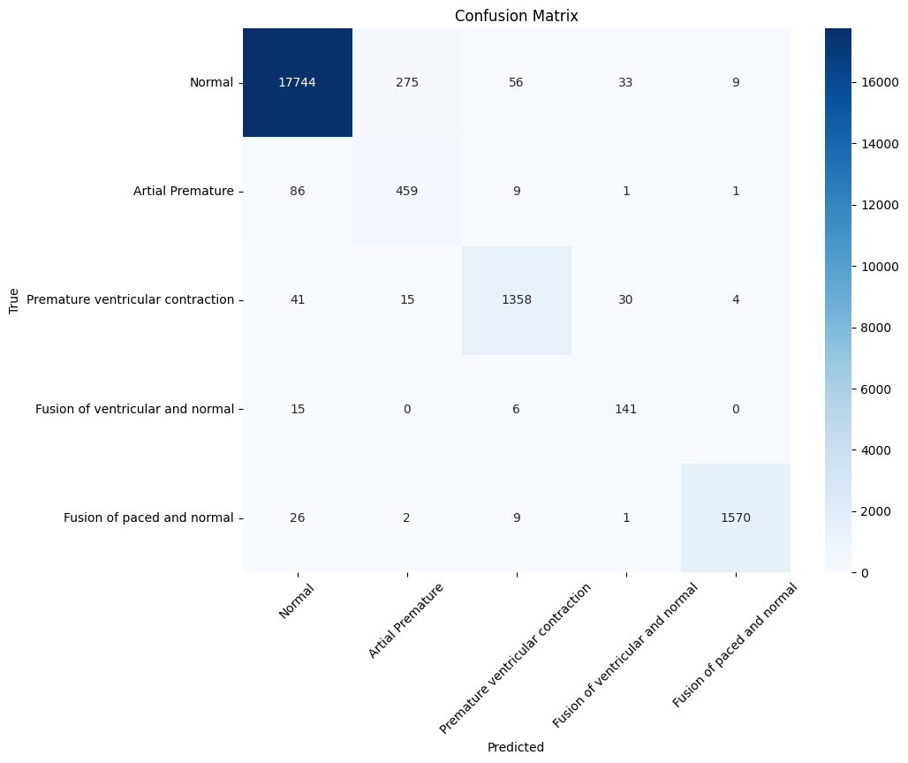

# ECG Beat Classification using Deep Learning

This project uses a deep neural network to classify ECG beats from the MIT-BIH Arrhythmia Database into five categories. It includes data preprocessing, model training with class balancing, hyperparameter tuning using Keras Tuner, and performance evaluation.

## Dataset

The dataset contains single ECG beats extracted from the MIT-BIH dataset, with each beat represented as 187 time steps and a class label.

**Class Labels:**
- `0`: Normal
- `1`: Atrial Premature
- `2`: Premature Ventricular Contraction (PVC)
- `3`: Fusion of Ventricular and Normal
- `4`: Fusion of Paced and Normal

## Preprocessing

- Each ECG beat is normalized (zero mean, unit variance).
- Labels are one-hot encoded.
- Data is split into training and testing sets.

## Model Architecture

The final model is a fully connected neural network with the following features:
- Input: 187-dimensional vector
- Hidden Layers: 2 Dense layers (256 units each)
- Regularization:
  - Batch Normalization
  - Dropout (0.3)
  - L2 regularization
- Output: Softmax layer (5 units for classification)

Compiled with:
- Optimizer: Adam (`lr=0.0005`)
- Loss: Categorical Crossentropy
- Metric: Accuracy

## Training Strategy

- Epochs: 300
- Batch Size: 4096
- Class weights manually tuned to address class imbalance
- Final model saved as `ECG.keras`

## Results

- **Test Accuracy**: 97.17%
- **Weighted F1-Score**: 97.32%

### Confusion Matrix

### Per-Class Accuracy

| Class                         | Accuracy |
|------------------------------|----------|
| Normal                       | *0.9794* |
| Atrial Premature             | *0.8255* |
| Premature Ventricular Contraction | *0.9375* |
| Fusion of Ventricular and Normal | *0.8704* |
| Fusion of Paced and Normal   | *0.9764* |

## Hyperparameter Tuning

Used **Keras Tuner** with **Random Search** across:
- Layers: 2–4
- Units per layer: 32–160
- Dropout: 0.1–0.3
- L2 regularization: 1e-4 to 1e-2
- Learning rate: 1e-4 to 1e-2

