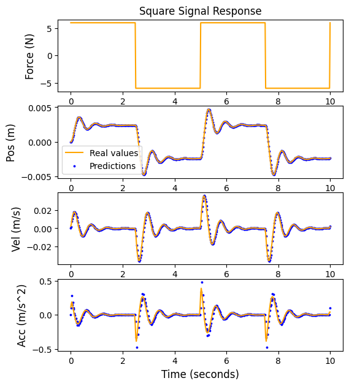
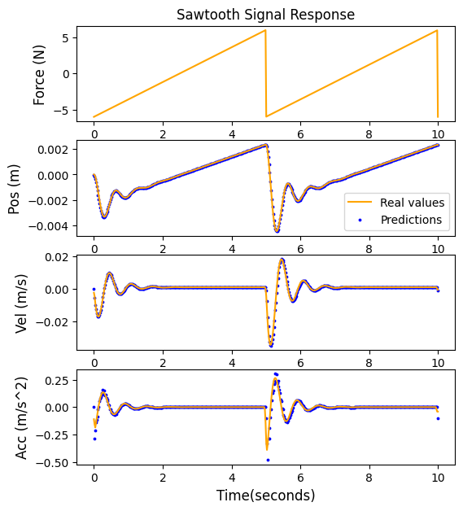
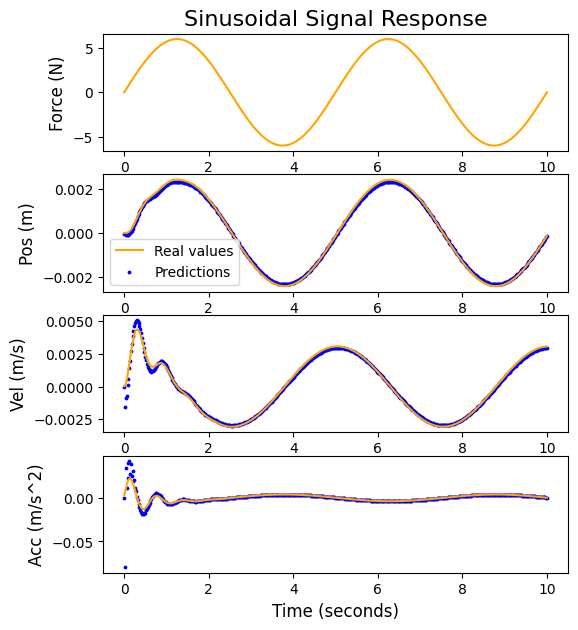
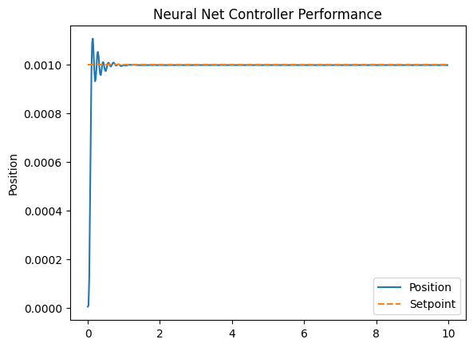

# RNN-based System Identification and Control

A hands-on project that simulates a mass-spring-damper system and uses simple RNN models to both identify and control it.

## Table of Contents
- [Description](#description)
- [Features](#features)
- [Prerequisites](#prerequisites)
- [Installation](#installation)
- [Project Structure](#project-structure)
- [Usage](#usage)
- [Results](#results)
- [Contributing](#contributing)

## Description

This repo is split into two main parts:

1. **System Identification**  
   Train a SimpleRNN model to predict how the system moves (position) when you push on it.
2. **Control**  
   Use that model to build a controller that drives the system toward a target position.

The dynamic system is a mass connected to a spring and damper, driven by different input signals (square, sawtooth, sine).

## Features

- Generate and visualize system responses to square, sawtooth, and sine wave inputs.
- Train a SimpleRNN to learn the plant (mass-spring-damper) behavior.
- Build a classic P controller and a neural-network-based controller.
- End-to-end training of controller + plant in one model.
- Save and load trained models for reuse.

## Prerequisites

- Python 3.8 or higher
- `numpy`, `pandas`, `matplotlib`, `scipy`, `scikit-learn`
- `tensorflow`, `keras`
- `control`

Install all with:
```bash
pip install control numpy pandas matplotlib scipy scikit-learn tensorflow keras
```

## Installation

Clone this repo:
```bash
git clone https://github.com/yourusername/your-repo-name.git
cd your-repo-name
```

Install the prerequisites (see above).

## Project Structure

```
/System Identification.py       # Data generation and RNN training for plant model
/Control.py                     # Load plant model, apply controllers, train final controller
/trained_SRNN_model.keras       # Saved RNN model for system identification
/ctrlxplantfinal.keras          # Saved combined controller + plant model
/ctrl_final.keras               # Saved standalone neural-network controller
/model_checkpoint.keras         # Checkpoints saved during RNN training
/images/                        # Folder to store plot images for README
README.md                       # This file
LICENSE                         # License info
```

## Usage

### 1. Identify the System (Plant)

```bash
python "System Identification.py"
```

Uncomment the plotting section in that script if you want to see the training/validation curves.

### 2. Control the System

Make sure the paths to `trained_SRNN_model.keras`, `ctrlxplantfinal.keras`, and `ctrl_final.keras` in `Control.py` point to your model files.

Then run:
```bash
python "Control.py"
```

You’ll get plots showing how well the controller drives the mass to the setpoint, along with error metrics (IAE, ISE, RMSE).

## Results

Here are the main plots illustrating the system identification and control performance:

### System Response to Square Wave Input


### System Response to Sawtooth Wave Input


### System Response to Sine Wave Input


### Position Control Performance


Make sure you save your generated images into the `/images` folder with these exact names.

## Contributing

Feel free to open issues or send pull requests. Contributions like fixing typos, improving docs, or adding new features are always welcome!

## License

This project is available under the MIT License. See [LICENSE](LICENSE) for details.

